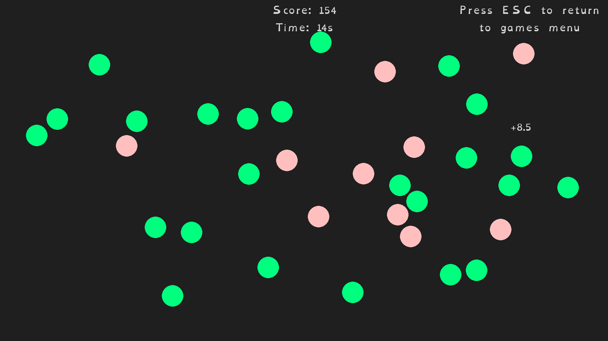

# Sharp Minds

Three short cognitive training games for people with ADHD, written in Python with pygame. Each game has its own difficulty level that adjusts after every round based on how well you did.

This was my final year project for a BSc in Computer Science at Queen Mary University of London (First Class).

Sharp Minds is not a prescribed treatment and is not part of any treatment programme.



## The games

All three games are played with the mouse. Press Esc at any time to go back to the games menu.

- **Expose the Criminal** trains selective attention and impulse control. Circles in two colours appear around the screen for 30 seconds. Click the target colour as fast as you can and leave the other colour alone. Clicking the wrong circle or the background loses points, and so does letting a target circle disappear.
- **Memory Experiment** trains visual working memory. A grid of coloured shapes is shown. When you are ready, the grid is hidden and you rebuild it from memory by picking a shape and a colour for each cell. Exact matches score full points, cells with the right shape or right colour score a third, and correctly empty cells score a little.
- **Pattern Rush** trains visual matching under time pressure. Seven rotating grids are shown, containing three matching pairs and one odd one out. Click two grids to pair them. Faster, correct pairs score more, wrong pairs cost points, and finishing early gives a time bonus.

## Adaptive difficulty

Each game has its own difficulty level, saved in `settings.txt` under `Adaptive Difficulty`. All three start at 2.

At the end of a completed round the game compares your score with a target score and turns the difference into an adjustment, which is added to the level. The adjustment is a real number, not a fixed step, so a close miss changes the level a little and a big win or loss changes it a lot. The level has no upper limit and never goes below 0.2. Leaving a round early with Esc does not change it.

| Game | Target score | How the gap becomes an adjustment | What a higher level changes |
| --- | --- | --- | --- |
| Expose the Criminal | 80% of the maximum points for every target circle that appeared, plus the points earned from non-target circles that expired | Gap divided by 100 | Smaller circles that appear more often and disappear sooner |
| Memory Experiment | 90% of the maximum score for the round | Gap divided by the points for one correct cell. Below target it goes through `((2x)^3 + x) / 2`, so small misses cost little and big misses cost a lot. Above target it is multiplied by 4 | Bigger grid and more shapes to remember |
| Pattern Rush | All three pairs matched with no mistakes and a third of the time left | Gap divided by the score for a perfect set of matches, times 5. Then divided by 10 if below target, or doubled if above | Bigger grids with more filled cells, faster rotation and a shorter time limit |

The game over screen shows your score, your previous best and a 1 to 5 star rating based on the same adjustment.

## Built with

- Python 3.12+
- [pygame](https://www.pygame.org/) 2.6.1 for graphics, input and sound
- [NumPy](https://numpy.org/) 2.2.4 for the piecewise difficulty curves
- [requests](https://requests.readthedocs.io/) 2.32.3 for leaderboard calls
- [python-dotenv](https://pypi.org/project/python-dotenv/) 1.1.0 to load the leaderboard URL from `.env`
- Firebase Realtime Database (REST API) for the online leaderboards
- [OpenDyslexic](https://antijingoist.itch.io/opendyslexic?download) as the default font

## Running it

The easiest way to play is to download the latest build from [Releases](https://github.com/xMalso/SharpMinds/releases), which has the leaderboard already set up.

To run from source:

1. Install Python 3.12 or newer. Older versions will not work because the code uses f-string syntax added in 3.12.
2. Clone the repo and set up a virtual environment:

   ```bash
   git clone https://github.com/xMalso/SharpMinds.git
   cd SharpMinds
   python -m venv .venv
   source .venv/bin/activate    # Windows: .venv\Scripts\activate
   pip install -r requirements.txt
   ```

3. Create a `.env` file in the project root pointing at a Firebase Realtime Database, with no trailing slash:

   ```
   LB_URL=https://your-project-default-rtdb.firebaseio.com
   ```

   The game reads and writes scores at `LB_URL/game1/<user id>.json` (and `game2`, `game3`), so the database rules need to allow this. The leaderboard URL used by the release build is not included in this repo.

   You can skip this step. Without `LB_URL` the games still work, but scores are not saved online, your previous best shows as 0 and the Leaderboards button takes you back to the main menu.

4. Run it from the project root, since asset paths are relative:

   ```bash
   python main.py
   ```

On first launch you are asked for a username (press Enter without typing one to get a random name). The game then creates `settings.txt`, `id.txt` and `latestlog.txt` in the project folder. The window opens borderless at your screen resolution. Window type, resolution, font, font size and all colours can be changed in Settings.

## Project structure

```
SharpMinds/
├── main.py               # Entry point: settings, main loop, leaderboard calls, difficulty updates
├── requirements.txt
├── pages/                # One module per screen
│   ├── ExposetheCriminal.py
│   ├── MemoryExperiment.py
│   ├── PatternRush.py
│   └── ...               # Menus, settings, game over and leaderboards
└── assets/
    ├── fonts/            # OpenDyslexic
    ├── images/           # Game menu images
    └── sounds/           # Correct and wrong answer sounds
```
